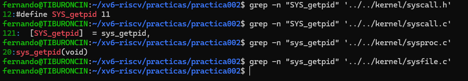
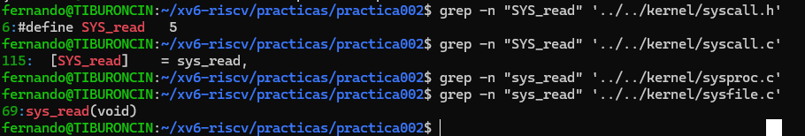

# Práctica 002: Llamadas al Sistema en xv6

**Estudiante:** [Fernando Simbron Aguirre]  
**Curso:** Sistemas Operativos (IS-380)[cite: 1]  
**Docente:** Ing. Leidy Rosmery Maldonado Chauca[cite: 1]  

---

## Parte 1: Interfaz, Tabla de Despacho e Implementación

### 1. Llamada Elegida: `getpid`

* **Interfaz (`kernel/syscall.h`):**[cite: 1]
  `#define SYS_getpid 11` (Línea identificada mediante grep)[cite: 1]
* **Tabla de despacho (`kernel/syscall.c`):**[cite: 1]
  `[SYS_getpid] sys_getpid,` (Asociación en el arreglo `syscalls[]`)[cite: 1]
* **Implementación (`kernel/sysproc.c`):**[cite: 1]
  `uint64 sys_getpid(void)` (Definición de la función)[cite: 1]

> **Conexión de componentes:**
> La llamada `getpid` se define mediante la macro `SYS_getpid` asociada a un número constante entero dentro de `kernel/syscall.h`[cite: 1]. Este número es utilizado por `kernel/syscall.c` como índice dentro de la tabla de despacho `syscalls[]` para mapear dicho entero con la dirección de memoria de la función `sys_getpid`[cite: 1]. Finalmente, la lógica que resuelve la petición para obtener el identificador del proceso se ejecuta dentro de la función `sys_getpid()`, ubicada en el archivo `kernel/sysproc.c`[cite: 1].

*(Insertar captura de pantalla de los comandos grep para getpid aquí)*

---

### 2. Llamada Elegida: `read`

* **Interfaz (`kernel/syscall.h`):**[cite: 1]
  
`#define SYS_read 5` (Línea identificada mediante grep)[cite: 1]
* **Tabla de despacho (`kernel/syscall.c`):**[cite: 1]
  `[SYS_read] sys_read,` (Asociación en el arreglo `syscalls[]`)[cite: 1]
* **Implementación (`kernel/sysfile.c`):**[cite: 1]
  `uint64 sys_read(void)` (Definición de la función)[cite: 1]

> **Conexión de componentes:**
> Para la llamada `read`, el identificador numérico `SYS_read` se establece en `kernel/syscall.h`[cite: 1]. En `kernel/syscall.c`, esta constante posiciona a la función `sys_read` en la tabla de punteros `syscalls[]`[cite: 1]. Como la operación involucra lectura de descriptores e interacción con sistemas de archivos o entrada/salida, su lógica funcional `sys_read()` se encuentra implementada en `kernel/sysfile.c`[cite: 1].

*(Insertar captura de pantalla de los comandos grep para read aquí)*

---

## Parte 2: Investigación del Mecanismo de Trampa (Trap)

### Explicación del camino completo de la llamada al sistema:

1. **Invocación en Espacio de Usuario:** El programa de usuario coloca el identificador numérico de la llamada en el registro `a7` del procesador y ejecuta la instrucción ensamblador `ecall`[cite: 1].
2. **Cruce al Kernel:** La instrucción `ecall` eleva el nivel de privilegio de la CPU y salta a la función de manejo `usertrap()` en `kernel/trap.c`[cite: 1].
3. **Reconocimiento del Trap:** Dentro de `usertrap()`, el kernel consulta la causa mediante `r_scause() == 8`, verificando que la trampa corresponde a una llamada al sistema realizada desde espacio de usuario, e invoca a `syscall()`[cite: 1].
4. **Lectura de Registro y Despacho:** La función `syscall()` en `kernel/syscall.c` extrae el valor almacenado en el registro `a7` desde la estructura `p->trapframe->a7` del proceso actual[cite: 1].
5. **Ejecución:** Utilizando dicho número como índice dentro del arreglo `syscalls[]`, salta a ejecutar la función correspondiente (por ejemplo, `sys_getpid` o `sys_read`)[cite: 1].

### Investigación Adicional: Trapframe

* **¿Qué es?:** El `trapframe` es una estructura de datos asignada por cada proceso en xv6 que reserva un área dedicada en memoria para almacenar el estado completo de los registros de la CPU[cite: 1].
* **¿Por qué es necesario guardarlo?:** Al cambiar del modo usuario al modo kernel, el procesador debe utilizar los mismos registros de hardware para la ejecución de las funciones del núcleo. El `trapframe` permite respaldar los valores originales antes de que sean alterados, asegurando que al finalizar la llamada al sistema se pueda restaurar exactamente el contexto y el flujo de ejecución del programa de usuario sin corrupción de datos[cite: 1].

---

## Parte 3: Preguntas de Reflexión

1. **Criterio de separación entre `sysproc.c` y `sysfile.c`:**
   La separación responde a un criterio de modulación por subsistemas dentro del núcleo de xv6[cite: 1]. `sysproc.c` contiene la implementación de llamadas orientadas a la gestión del estado, ciclo de vida y recursos de los procesos (como `fork`, `getpid`, `kill`, `wait`)[cite: 1]. Por su parte, `sysfile.c` agrupa las funciones asociadas a la manipulación de descriptores de archivo, entrada/salida y sistema de archivos (como `read`, `write`, `open`, `close`)[cite: 1].

2. **¿Por qué transmitir el número vía registro `a7` y no memoria compartida?:**
   Transmitir el parámetro por un registro del procesador como `a7` es rápido, atómico y seguro[cite: 1]. Los espacios de memoria virtual entre el usuario y el kernel están aislados por la MMU por razones de seguridad. Acceder a una variable en memoria compartida requeriría deshabilitar protecciones o gestionar mapeos complejos, mientras que un registro de la CPU es accesible instantáneamente por la arquitectura en la transición de privilegios.

3. **Manejo de llamadas concurrentes entre procesos distintos:**
   El kernel de xv6 mantiene este aislamiento debido a que cada proceso posee su propia instancia de la estructura `struct proc`, la cual contiene una página independiente para su propio `trapframe` y una pila separada en el espacio del kernel (*kstack*)[cite: 1]. Cuando ocurre una interrupción o trap, los registros de cada proceso se guardan en su propio `trapframe` único, impidiendo la interferencia o mezcla de datos entre procesos independientes[cite: 1].
